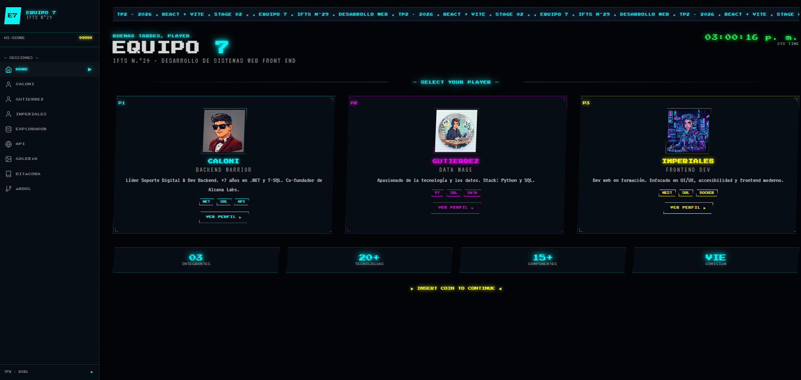
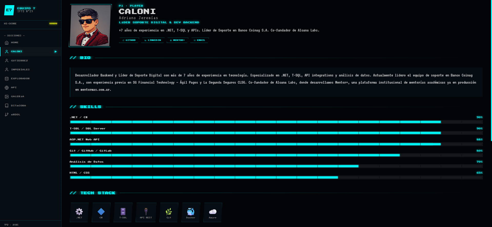
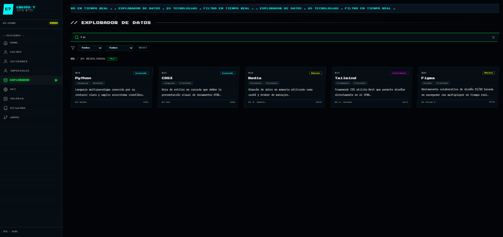
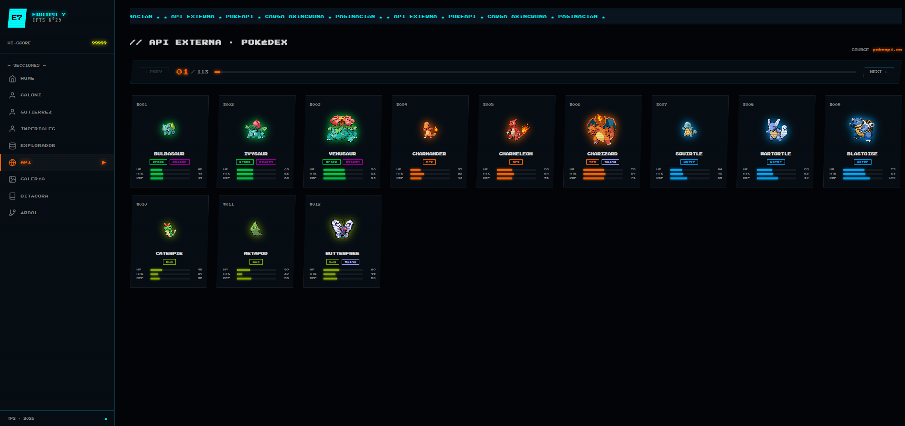
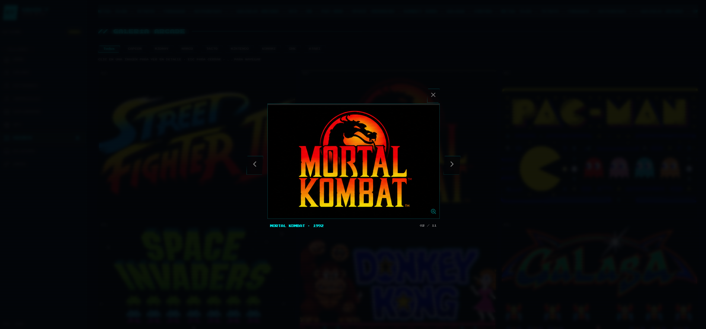
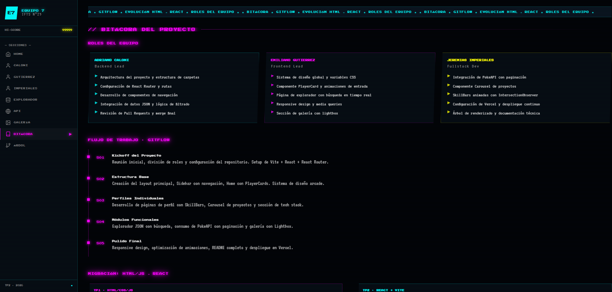
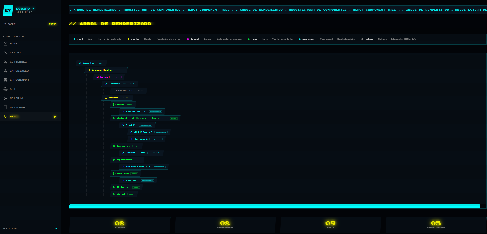

# 🕹️ EQUIPO 7 — TP2 · Proyecto React

**IFTS N.°29 · Desarrollo de Sistemas Web Front End · Comisión Viernes**

> 🚀 **Deploy:** [https://tp2-grupo-7-a7oa.vercel.app](https://tp2-grupo-7-a7oa.vercel.app)
> 📁 **Repositorio:** [https://github.com/AdrianoJere/tp2-grupo_7](https://github.com/AdrianoJere/tp2-grupo_7)

---

## 📋 Descripción

Este proyecto es la **evolución y migración** del Trabajo Práctico 1 (desarrollado en HTML/CSS/JS vanilla) hacia una arquitectura de componentes con **React + Vite**. Es una Single Page Application (SPA) con estética arcade/retro que incluye:

- Dashboard principal con tarjetas animadas de cada integrante
- Perfiles individuales con skill bars, carrusel de proyectos y tech stack
- Explorador de datos JSON con filtrado y búsqueda en tiempo real
- Consumo de API externa (PokeAPI) con paginación
- Galería de imágenes arcade con Lightbox (ESC + navegación con teclado)
- Bitácora del proyecto con roles y análisis de migración HTML→React
- Árbol de renderizado de componentes

---

## 👥 Integrantes

| Nombre | Rol | GitHub |
|--------|-----|--------|
| Adriano Jeremías Caloni | Backend Lead | [@AdrianoJere](https://github.com/AdrianoJere) |
| Emiliano Gutierrez | Frontend Lead | [@emilianog4](https://github.com/emilianog4) |
| Jeremías Imperiales | Fullstack Dev | [@imperialesjeremias](https://github.com/imperialesjeremias) |

---

## 🛠️ Tecnologías Utilizadas

| Tecnología | Uso |
|------------|-----|
| **React 18** | Biblioteca principal de UI |
| **Vite 6** | Build tool y dev server |
| **React Router DOM 7** | Navegación SPA y rutas |
| **react-icons** | Iconografía (Feather Icons) |
| **CSS3** | Estilos, animaciones y variables custom |
| **Google Fonts** | Press Start 2P + VT323 |
| **PokeAPI** | API externa pública |
| **Vercel** | Hosting y despliegue continuo |

---

## 📁 Estructura de Archivos

```
tp2-grupo_7/
├── public/
│   ├── gallery/          ← imágenes de la galería arcade
│   └── proyectos/        ← imágenes de proyectos del carrusel
├── docs/                 ← capturas de pantalla para el README
├── src/
│   ├── components/
│   │   ├── Sidebar/      ← navegación lateral fija
│   │   ├── PlayerCard/   ← tarjeta animada de integrante
│   │   ├── SkillBar/     ← barra de progreso con IntersectionObserver
│   │   ├── Carousel/     ← carrusel manual de proyectos
│   │   └── Lightbox/     ← modal de imagen (ESC + ←/→)
│   ├── pages/
│   │   ├── Home.jsx      ← dashboard con grilla de PlayerCards
│   │   ├── Profile.jsx   ← template reutilizable de perfil
│   │   ├── Caloni.jsx    ← perfil P1
│   │   ├── Gutierrez.jsx ← perfil P2
│   │   ├── Imperiales.jsx← perfil P3
│   │   ├── Explorer.jsx  ← filtrado en tiempo real sobre JSON local
│   │   ├── ApiModule.jsx ← PokeAPI con paginación
│   │   ├── Gallery.jsx   ← grid de imágenes + Lightbox
│   │   ├── Bitacora.jsx  ← roles, timeline y análisis de migración
│   │   └── Arbol.jsx     ← árbol de renderizado de componentes
│   ├── data/
│   │   └── techData.json ← 20 objetos de tecnologías
│   ├── styles/
│   │   └── global.css    ← variables CSS, reset, animaciones globales
│   ├── App.jsx           ← Router + Layout principal
│   └── main.jsx          ← Entry point
├── index.html
├── package.json
└── vite.config.js
```

---

## 🎨 Guía de Estilos

### Paleta de Colores

| Nombre | Hex | Uso |
|--------|-----|-----|
| Fondo principal | `#020408` | Background base |
| Fondo secundario | `#060d14` | Cards, sidebar |
| Fondo terciario | `#0a1520` | Elementos elevados |
| Cyan — P1 Caloni | `#00ffff` | Acento principal |
| Magenta — P2 Gutierrez | `#ff00ff` | Acento secundario |
| Amarillo — P3 Imperiales | `#ffff00` | Acento terciario |
| Verde | `#00ff41` | Explorador, datos |
| Naranja | `#ff6600` | API, alertas |
| Texto principal | `#e0e0e0` | Body text |
| Texto apagado | `#888888` | Labels, subtextos |

### Tipografías

| Fuente | Uso | Link |
|--------|-----|------|
| [Press Start 2P](https://fonts.google.com/specimen/Press+Start+2P) | Títulos, labels, UI pixel | Google Fonts |
| [VT323](https://fonts.google.com/specimen/VT323) | Cuerpo de texto retro | Google Fonts |

### Iconografía

**react-icons** — paquete Feather Icons (`fi`): `FiHome`, `FiUser`, `FiDatabase`, `FiGlobe`, `FiImage`, `FiBook`, `FiGitBranch`, `FiSearch`, `FiFilter`, `FiGithub`, `FiLinkedin`, `FiChevronLeft`, `FiChevronRight`, `FiX`, `FiLoader`, `FiZoomIn`, `FiExternalLink`, `FiMenu`, `FiMail`, `FiTwitter`

---

## ⚛️ JavaScript / React — Funciones Dinámicas

### Hooks utilizados

| Hook | Componente | Uso |
|------|-----------|-----|
| `useState` | Home, Explorer, ApiModule, Gallery, Sidebar, Carousel | Estado de UI y datos |
| `useEffect` | ApiModule, SkillBar, Home | Fetch async, IntersectionObserver, reloj |
| `useMemo` | Explorer | Filtrado optimizado del JSON en tiempo real |
| `useCallback` | Lightbox, Gallery | Estabilizar funciones de navegación con teclado |
| `useRef` | SkillBar | Referencia al DOM para IntersectionObserver |

### Implementaciones clave

**SkillBar — animación al entrar al viewport:**
```jsx
const observer = new IntersectionObserver(([entry]) => {
  if (entry.isIntersecting) {
    setTimeout(() => setWidth(value), delay)
    observer.disconnect()
  }
}, { threshold: 0.3 })
```

**Explorer — filtrado en tiempo real con useMemo:**
```jsx
const results = useMemo(() => {
  return techData.filter(item =>
    item.nombre.toLowerCase().includes(query.toLowerCase()) &&
    (tipo === 'Todos' || item.tipo === tipo) &&
    (nivel === 'Todos' || item.nivel === nivel)
  )
}, [query, tipo, nivel])
```

**ApiModule — fetch asíncrono con cleanup:**
```jsx
useEffect(() => {
  let cancelled = false
  async function fetchPage() {
    setLoading(true)
    try {
      const list = await fetch(`https://pokeapi.co/api/v2/pokemon?limit=12&offset=${page*12}`)
      const details = await Promise.all(list.results.map(p => fetch(p.url).then(r => r.json())))
      if (!cancelled) setData(details)
    } catch(e) { setError(e.message) }
    finally { if (!cancelled) setLoading(false) }
  }
  fetchPage()
  return () => { cancelled = true }
}, [page])
```

**Lightbox — navegación con teclado:**
```jsx
useEffect(() => {
  document.addEventListener('keydown', handleKey)
  return () => document.removeEventListener('keydown', handleKey)
}, [handleKey])
```

### Capturas de pantalla

**Home — Dashboard con PlayerCards animadas**


**Perfil Caloni — SkillBars + Carrusel de proyectos**


**Explorador — Búsqueda y filtrado en tiempo real**


**API Externa — PokeAPI con paginación**


**Galería Arcade — Grid con Lightbox**


**Bitácora — Roles y análisis de migración**


**Árbol de Renderizado — Arquitectura de componentes**


---

## 🌐 Enlace al Proyecto Desplegado

**Vercel:** [https://tp2-grupo-7-a7oa.vercel.app](https://tp2-grupo-7-a7oa.vercel.app)

**Configuración de deploy:**
- Framework: **Vite**
- Build command: `npm run build`
- Output directory: `dist`

---

## 📈 Evolución: TP1 → TP2

| Aspecto | TP1 (HTML/CSS/JS) | TP2 (React + Vite) |
|---------|------------------|-------------------|
| Estructura | 5 archivos HTML separados | SPA con 9 rutas |
| Estilos | 1 CSS global | CSS modular por componente |
| Navegación | `<a href="">` con recarga de página | React Router sin recarga |
| Estado | Variables JS globales | `useState` + `useMemo` |
| Datos | Hardcoded en HTML | Componentes con props + JSON local |
| APIs externas | No implementado | PokeAPI asíncrona con paginación |
| Reutilización | Código duplicado entre páginas | Componente `Profile` compartido entre 3 perfiles |
| Interactividad | Manipulación manual del DOM | Declarativa con React |

### Historial de commits principales

| Versión | Descripción |
|---------|-------------|
| `v1 — init` | Setup Vite + React + Router, estructura base, todos los componentes y páginas |
| `v2 — fix responsive` | Corrección de overflow horizontal, árbol de renderizado rediseñado, breakpoints móvil |
| `v3 — perfiles reales` | Datos reales de cada integrante desde sus portafolios personales |
| `v4 — fix layout` | Ancho del contenido principal corregido con `calc(100% - sidebar)` |
| `v5 — galería arcade` | Imágenes de juegos clásicos en `public/gallery/`, fix de imports para Vercel |
| `v6 — proyectos Caloni` | Logos reales de Mentor+, Alcana Labs y Grupo Coinag en el carrusel |

---

## 🤖 Uso de Inteligencia Artificial

| Herramienta | Uso |
|-------------|-----|
| **Claude (Anthropic — Sonnet 4.6)** | Arquitectura del proyecto, todos los componentes React, lógica de hooks, sistema de diseño CSS, debugging de errores de build y deploy, README |
| **Gemini (Google)** | Generación de logos con efecto neón: Mentor+, Alcana Labs, Grupo Coinag |

**Contenido generado con IA:**
- Estructura completa de componentes y páginas
- Sistema de diseño arcade (variables CSS, animaciones, scanlines)
- Lógica de `IntersectionObserver` para SkillBars
- Fetch asíncrono con cleanup en ApiModule
- Corrección de bugs de build en Vercel (imports de imágenes, overflow horizontal)
- Textos de bio y descripciones de proyectos

**Imágenes generadas con IA:**
- Logos con efecto neón (Gemini) — prompt: *"logo [nombre] estilo neon glow, fondo negro, colores vibrantes, pixel art aesthetic"*

**Autoría del equipo:**
- Decisiones de diseño y estética arcade
- Personalización de datos reales de cada integrante
- Integración, testing y debugging final
- Gestión del repositorio y deploy en Vercel

---

*TP2 · Desarrollo de Sistemas Web Front End · IFTS N.°29 · Comisión Viernes · 2026*
